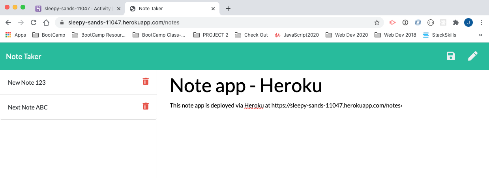

<h1>Note Taker</h1>
<h2>John Manouse</h2>

I created an application that will allow you to write, save, edit, and delete notes. The user will enter the note information in the browser, and the note files will be saved and retrieved from a JSON database file. The application will use node modules, Express, & API routes, to link the front end to the back end of the application.

 
<h2>Note Taker Summary</h2>
<ul>
    <li>HTML code</li>
    <li>CSS</li>
    <li>Javascript</li>
    <li>node.js</li>
    <li>express</li>
</ul>

<h2>Pull Requests welcome for contribution</h2>

John Manouse

Live Link: <a href="https://sleepy-sands-11047.herokuapp.com/">Note-Taker Live Link</a>

Github: <a href="https://github.com/Mirageg4/Note-Taker">Note-Taker Repo</a>

              

License: Project is licensed under the MIT License. 
See <a href ="LICENSE.md">LICENSE</a> file for details.